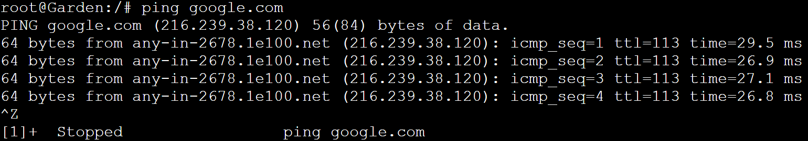

# Jarkom-Modul-3-ITA04-2022
Nama Anggota | NRP
------------------- | --------------		
Nida'ul Faizah | 5027201064
Kevin Oktoaria | 5027201046
Najwa Amelia Qorry 'Aina | 5027201001

## Soal 1
Loid bersama Franky berencana membuat peta tersebut dengan kriteria WISE sebagai DNS Server, Westalis sebagai DHCP Server, Berlint sebagai Proxy Server (1)

### Jawab
Pertama-tama kita perlu membuat Topologi sesuai soal, Topologi yang telah kami buat adalah sebagai berikut:


Setelah itu kita perlu melakukan konfigurasi pada setiap node, berikut adalah konfigurasi setiap node:

#### Konfigurasi Ostania
```
auto eth0
iface eth0 inet dhcp

auto eth1
iface eth1 inet static
	address 192.212.1.1
	netmask 255.255.255.0

auto eth2
iface eth2 inet static
	address 192.212.2.1
	netmask 255.255.255.0

auto eth3
iface eth3 inet static
	address 192.212.3.1
	netmask 255.255.255.0
```

#### Konfigurasi Client
Client SSS, Garden, NewstownCastle, KemonoPark
```
auto eth0
iface eth0 inet dhcp
```

#### Konfigurasi Client Eden
Pada CLient Eden yang akan mendaptkan alamat yang tetap 192.212.3.13 dilakukan konfigurasi:
```
auto eth0
iface eth0 inet dhcp
hwaddress ether 36:2e:46:e7:f6:90
```

#### Konfigurasi Wise
```
auto eth0
iface eth0 inet static
	address 192.212.2.2
	netmask 255.255.255.0
	gateway 192.212.2.1
```

#### Konfigurasi Berlint
```
auto eth0
iface eth0 inet static
	address 192.212.2.3
	netmask 255.255.255.0
	gateway 192.212.2.1
```

#### Konfigurasi Westalis
```
auto eth0
iface eth0 inet static
	address 192.212.2.4
	netmask 255.255.255.0
	gateway 192.212.2.1
```

WISE sebagai DNS Server
Pada WISE, kami menjalankan beberapa command untuk menjadikannya DNS Server
```
echo "nameserver 192.168.122.1" > /etc/resolv.conf
apt-get update
apt-get install bind9 -y
```

Westalis sebagai DHCP Server
Selanjutnya pada Westalis yang akan dijadikan DHCP Server dijalankan command berikut
```
echo "nameserver 192.168.122.1" > /etc/resolv.conf
apt-get update
apt-get install isc-dhcp-server -y
```

Berlint sebagai Proxy Server
Lalu pada Berlint sebagai Proxy Server dilakukan install squid
```
echo "nameserver 192.168.122.1" > /etc/resolv.conf
apt-get update
apt-get install libapache2-mod-php7.0 -y
apt-get install squid -y
```


## Soal 2
Ostania sebagai DHCP Relay (2)

### Jawab
Untuk menjadikan Ostania sebagai DHCP Relay perlu dilakukan install isc-dhcp-relay
```
apt-get update
iptables -t nat -A POSTROUTING -o eth0 -j MASQUERADE -s 192.212.0.0/16
apt-get install isc-dhcp-relay -y
```
Dalam proses download dhcp-relay, IP Westalis (192.217.2.4) sebagai dhcp-server dan interfaces akan listen to eth1 eth2 eth3 seperti gambar berikut:


## Soal 3
Client yang melalui Switch1 mendapatkan range IP dari [prefix IP].1.50 - [prefix IP].1.88 dan [prefix IP].1.120 - [prefix IP].1.155 (3)

### Jawab
Lorem


## Soal 4
Client yang melalui Switch3 mendapatkan range IP dari [prefix IP].3.10 - [prefix IP].3.30 dan [prefix IP].3.60 - [prefix IP].3.85 (4)

### Jawab
Lorem


## Soal 5
Client mendapatkan DNS dari WISE dan client dapat terhubung dengan internet melalui DNS tersebut. (5)

### Jawab
Agar client mendapatkan DNS dari WISE, dilakukan konfigurasi pada file /etc/dhcp/dhcpd.conf dengan option domain-name-servers 192.212.2.2;

Selanjutnya agar client terhubung ke internet, dilakukan konfigurasi pada file /etc/bind/named.conf.options sebagai berikut
```
options {
        directory \"/var/cache/bind\";
        forwarders {
                192.168.122.1;
        };
        // dnssec-validation auto;
        allow-query { any; };
        auth-nxdomain no;
        listen-on-v6 { any; };
};
" > /etc/bind/named.conf.options
service bind9 restart
```

#### Testing
Berhasil mencoba ping ke `google.com` pada client yang menunjukkan telah terhubung ke internet
SSS


Garden


Eden


NewstonCastle


KemonoPark


## Soal 6
Lama waktu DHCP server meminjamkan alamat IP kepada Client yang melalui Switch1 selama 5 menit sedangkan pada client yang melalui Switch3 selama 10 menit. Dengan waktu maksimal yang dialokasikan untuk peminjaman alamat IP selama 115 menit. (6)

### Jawab
Dilakukan konfigurasi untuk mengatur lama waktu DHCP server meminjamkan alamat IP kepada Client pada subnet interfase Switch1 dan Switch3 dalam file /etc/dhcp/dhcpd.conf seperti berikut:
```
subnet 192.212.1.0 netmask 255.255.255.0 {
    ...
    default-lease-time 300; # 5 menit
    max-lease-time 6900; # 115 menit
    ...
}
subnet 192.212.3.0 netmask 255.255.255.0 {
    ...
    default-lease-time 600; # 10 menit
    max-lease-time 6900; # 115 menit
    ...
}
```

#### Testing
Terlihat pada client telah menunjukkan lease time-nya sesuai dengan konfigurasi yang diminta
SSS (Switch1)


Eden (Switch3)


## Soal 7
Loid dan Franky berencana menjadikan Eden sebagai server untuk pertukaran informasi dengan alamat IP yang tetap dengan IP [prefix IP].3.13 (7)

### Jawab
Dilakukan konfigurasi untuk alamat IP yang tetap (fixed address) pada file /etc/dhcp/dhcpd.conf seperti berikut:
```
host Eden {
    hardware ethernet 36:2e:46:e7:f6:90;
    fixed-address 192.212.3.13;
}
" >  /etc/dhcp/dhcpd.conf
```

Kemudian juga settingan konfigurasi network interface pada Eden juga disesuaikan seperti berikut:
```
auto eth0
iface eth0 inet dhcp
hwaddress ether 36:2e:46:e7:f6:90
```

#### Testing
Terlihat pada Eden telah mendapat alamat IP yang tetap atau fixed address `192.212.3.13` sesuai dengan konfigurasi yang diminta
Eden


